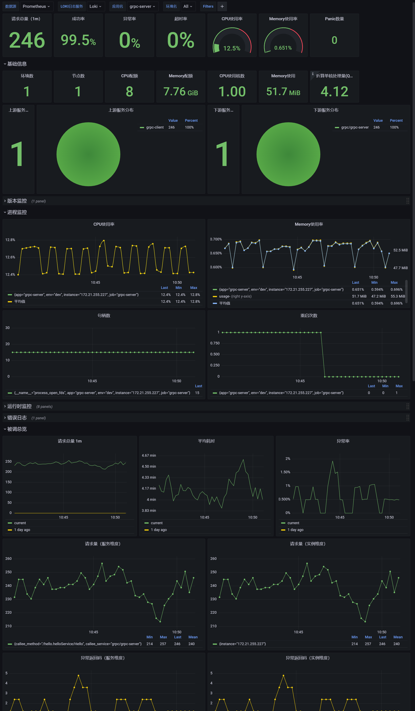

# 过滤器

将请求相关的特定逻辑组件化，插件化

# 组件请求、响应时接入过滤器

客户端触发

```go
// inject 模式
err := filter.TriggerClientFilterInject(ctx, clientName, req, rsp, func(ctx context.Context, req, rsp interface{}) error{
	return nil
})
// return 模式
rsp, err := filter.TriggerClientFilter(ctx, clientName, req, func(ctx context.Context, req interface{}) (rsp interface{}, err error){
	return "xxx", nil
})
```

服务端触发

```go
// inject 模式
err := filter.TriggerServiceFilterInject(ctx, serviceName, req, rsp, func(ctx context.Context, req, rsp interface{}) error{
	return nil
})
// return 模式
rsp, err := filter.TriggerServiceFilter(ctx, serviceName, req, func(ctx context.Context, req interface{}) (rsp interface{}, err error){
	return "xxx", nil
})
```

# 过滤器开发

首先实现 [core.Filter](../core/filter.go) 接口.

然后调用 `filter.RegisterFilterCreator` 注册过滤器. 如下

```go
clientFilterCreator = func() Filter{
    return newMyFilter()
}
serviceFilterCreator = func() Filter{
	return newMyFilter()
}
filter.RegisterFilterCreator("myFilter", clientFilterCreator, serviceFilterCreator)
```

如果仅注册服务过滤器或客户端过滤器, 可以将不需要的设为nil, 如下

```go
// 仅注册客户端过滤器
filter.RegisterFilterCreator("myFilter", clientFilterCreator, nil)
// 仅注册服务端过滤器
filter.RegisterFilterCreator("myFilter", nil, serviceFilterCreator)
```

## 过滤器配置

`component` 的配置类型是 `client`

```yaml
filters:
   service: # 服务过滤器
      default: # 对没有独立配置的服务设置默认的过滤器, 默认包含 base
         - filter1
         - filter2
      myService: # 独立设置服务的过滤器 
         - filter2
   client: # 客户端过滤器
      default: # 对没有独立配置的服务设置默认的过滤器
         default:
            - filter1
            - filter2
      sqlx: # sqlx类型
         default: # sqlx类型中对没有独立配置的客户端设置默认的过滤器
            - filter1
            - filter2
         mySqlx: # 独立设置客户端的过滤器 
            - filter2

   config: # 过滤器配置, 不同过滤器配置不同或不需要配置
      filter1:
         foo: bar
      filter2:
         foo: bar
```

配置查找方式为 自己组件类型和组件名的配置 -> 自己组件类型default组件名 -> default组件类型default组件名 -> 默认配置.

如果找到了指定的配置, 不会继承全局配置. 如下配置

```yaml
filters:
   client:
      default:
         default:
            - filter1
      a:
         default:
            - filter2
         foo:
            - filter3
```

在这个配置中. 组件类型查找到的配置如下:

 组件类型  | 组件名  | 过滤器     
-------|------|---------
 a     | foo  | filter3 
 a     | bar  | filter2 
 other | test | filter1 

### 配置参考

`base.gpool` 过程调用协程池

```yaml
filters:
   config:
      base.gpool:
         Config:
            # 任务队列大小
            JobQueueSize: 10000
            # 同时处理信息的goroutine数, 设为0时取逻辑cpu数量 * 2, 设为负数时不作任何限制, 每个请求有独立的线程执行
            ThreadCount: 0
```

`base.log` 过程调用日志级别

```yaml
filters:
   config:
      base.log:
         Service:
            default: 'debug'
         Client:
            default:
              default: 'debug'
```

`base.timeout` 过程调用超时

```yaml
filters:
   config:
      base.timeout:
         Service:
            default: 60000
         Client:
            default:
               default: 60000
```

## grafana 面板

在`grafana`的`Browse`中导入[这个json文件](./grafana-zapp-home.json)


